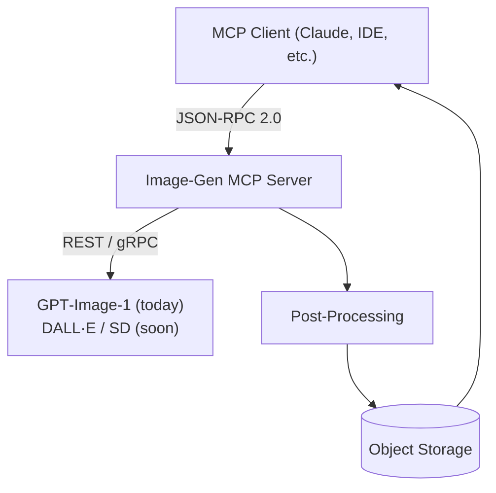

# AI Image‑Gen MCP Server

> **Version 0.1.0 – first public preview**\
> Conforms to the [Model Context Protocol spec (2025‑06‑18)](https://modelcontextprotocol.io/specification/2025-06-18).

---

## What’s this?

A lightweight **MCP server** that turns cutting‑edge image generators into plug‑and‑play tools for any MCP‑aware client. We start with **GPT‑Image‑1** from OpenAI; next releases will unlock DALL·E, Stable Diffusion and fully local engines – all selectable with a single flag.

### Why MCP?

MCP is the USB‑C of AI context: one cable, endless integrations. Ship one binary, hook it into Claude Desktop, VS Code, or your own chatbot, and the host handles UI, permissions and prompt plumbing.

### Quick examples

| You ask                                                       | The server replies                                          |
| ------------------------------------------------------------- | ----------------------------------------------------------- |
| *“Give me a slick hero background for my SaaS landing page.”* | Delivers a 3840×2160 PNG + CSS gradient vars                |
| *“Make that CTA button look like an 18th‑century brick.”*     | Generates a texture sprite and inline styles ready to paste |

If you can phrase it, the pipeline can render it. 💫

---

## Core MCP Concepts

This server exposes all three **MCP primitives**:

1. **Tools** – `generate_image`, `upscale_image`, `inpaint_image`
2. **Resources** – generated assets, prompt logs, experiment metadata
3. **Prompts** – reusable templates (e.g. *Product Mock‑up*, *Concept Art*)

---

## Feature Highlights

- **Model Switcher** – ships with **GPT‑Image‑1**; upcoming releases add DALL·E, Stable Diffusion, and local checkpoints.
- **Prompt Graphs** – YAML pipelines (txt2img → upscale → watermark).
- **Versioned Experiments** – hash prompt + seed + params; compare in UI.
- **Async Queue** – Celery/Kafka keeps GPUs busy but not angry.
- **RBAC** – per‑team access so interns can’t torch prod.

---

## Architecture



---

## Quickstart

### Prerequisites

- **Python 3.11+**
- **Docker 24+** (GPU containers)
- Optional: **CUDA 12** + nvidia‑docker for local rendering.

### Installation

```bash
git clone https://github.com/krystian-ai/ai-image-gen-mcp.git
cd ai-image-gen-mcp
python -m venv .venv && source .venv/bin/activate
pip install -e .[image,dev]   # pulls mcp[cli] & diffusers
```

### Configuration

Copy `.env.example` → `.env` and set:

```dotenv
OPENAI_API_KEY=sk-...
MODEL_DEFAULT=gpt-image-1
CACHE_DIR=/path/to/cache
```

### Run (stdio transport)

```bash
mcp-imageserve stdio  # or python -m ai_image_gen_mcp.server --transport=stdio
```

### Connect from Claude Desktop

```jsonc
{
  "mcpServers": {
    "image-gen": {
      "command": "mcp-imageserve",
      "args": ["stdio"],
      "transport": "STDIO"
    }
  }
}
```

Restart Claude ➜ `/image` tool appears.

---

## Roadmap

| Version | Focus                                               | Target Date |
| ------- | --------------------------------------------------- | ----------- |
| **0.1** | Basic functions, GPT‑Image‑1 support                | 2025‑08‑31  |
| **0.2** | DALL·E models + model‑mixing config                 | 2025‑09‑30  |
| **0.3** | Pre‑prompting & style presets for consistent output | 2025‑11‑30  |
| **0.4** | TBD – community‑driven features 🤔                  | 2026‑01‑30  |

---

## Contributing

Fork → branch → PR. Run `pre-commit` (black, ruff, mypy) before pushing. Document new tools/resources in `docs/`.

---

## License

**Apache 2.0** – see `LICENSE`.

---

## Links

- **MCP Introduction** – [https://modelcontextprotocol.io/introduction](https://modelcontextprotocol.io/introduction)
- **MCP Quickstart** – [https://modelcontextprotocol.io/quickstart/server](https://modelcontextprotocol.io/quickstart/server)
- **Spec 2025‑06‑18** – [https://modelcontextprotocol.io/specification/2025-06-18](https://modelcontextprotocol.io/specification/2025-06-18)
- **OpenAI API Docs** – [https://platform.openai.com/docs](https://platform.openai.com/docs)
- **Stable Diffusion Web UI** – [https://github.com/AUTOMATIC1111/stable-diffusion-webui](https://github.com/AUTOMATIC1111/stable-diffusion-webui)
- **OpenAI Image Vision API Docs** - [https://platform.openai.com/docs/guides/images-vision?api-mode=responses](https://platform.openai.com/docs/guides/images-vision?api-mode=responses)

