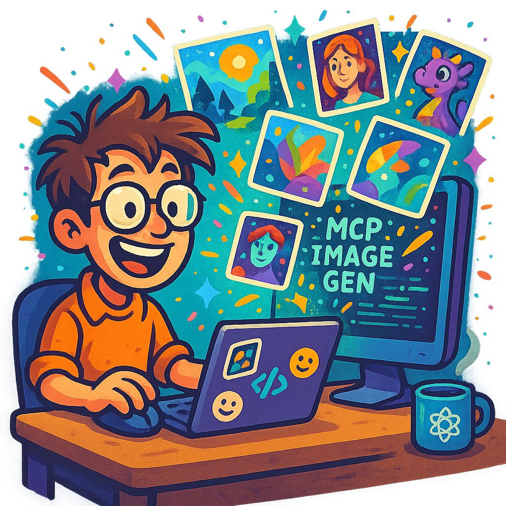
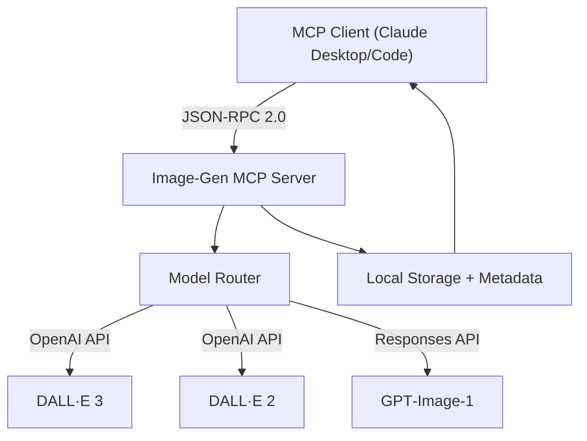

# AI Image‑Gen MCP Server

> **Version 0.1.0 – MVP public release**  
> Conforms to the [Model Context Protocol spec (2025‑06‑18)](https://modelcontextprotocol.io/specification/2025-06-18).

<p align="center">
  
  
</p>

[](https://www.python.org/downloads/)
[](https://opensource.org/licenses/MIT)
[](https://github.com/psf/black)
[](https://modelcontextprotocol.io/)

---

## What's this?

A production‑ready **MCP server** that transforms state‑of‑the‑art image generators into plug‑and‑play tools for any MCP‑aware client. Currently shipping with **DALL·E 3**, **DALL·E 2**, and experimental **GPT‑Image‑1** – all accessible through a unified interface.

### Why MCP?

MCP is the USB‑C of AI context: one protocol, endless integrations. Ship one server, hook it into Claude Desktop, Claude Code, VS Code, or your own chatbot – the host handles UI, auth, and conversation flow.

### Quick examples

| You ask                                                       | The server delivers                                          |
| ------------------------------------------------------------- | ----------------------------------------------------------- |
| *"Design a cyberpunk logo for my startup"*                   | High‑res PNG via DALL·E 3 with style presets               |
| *"Generate 5 variations of this product shot"*               | Batch generation via DALL·E 2 (n=5 support)                |
| *"Create concept art for a steampunk airship"*              | Artistic rendering with metadata and prompt history         |

If you can describe it, we can render it. 💫

---

## Core MCP Concepts

This server implements all three **MCP primitives**:

1. **Tools** – `generate_image` with model selection, size, and style options
2. **Resources** – Available models and their capabilities exposed as MCP resources
3. **Prompts** – Built‑in templates for `product_mockup` and `concept_art` workflows

---

## Feature Highlights

* **Multi‑Model Support** – **DALL·E 3** (default), **DALL·E 2**, and **GPT‑Image‑1** via unified API
* **Smart Storage** – Local cache with timestamped filenames and JSON metadata
* **Flexible Sizing** – From 256×256 thumbnails to 1792×1024 widescreen masterpieces
* **Style Control** – `vivid` or `natural` rendering (DALL·E 3)
* **Batch Generation** – Create up to 10 variations per prompt (DALL·E 2)
* **Claude Integration** – First‑class support for Desktop and Code editions

---

## Architecture



---

## Quickstart

### Prerequisites

* **Python 3.11+**
* **OpenAI API key**
* **Claude Desktop** or **Claude Code** (for MCP integration)

### Installation

```bash
git clone https://github.com/krystian-ai/ai-image-gen-mcp.git
cd ai-image-gen-mcp
python3.11 -m venv .venv && source .venv/bin/activate
pip install -e ".[image,dev]"
```

### Configuration

```bash
cp .env.example .env
# Edit .env and add your OpenAI API key
```

Key settings:
```dotenv
OPENAI_API_KEY=sk-...
MODEL_DEFAULT=dall-e-3
CACHE_DIR=/tmp/ai-image-gen-cache
```

### Run Standalone

```bash
# Via MCP CLI
mcp-imageserve stdio

# Direct execution
python -m ai_image_gen_mcp.server --transport=stdio
```

---

## Claude Desktop Integration

Add to `~/Library/Application Support/Claude/claude_desktop_config.json`:

```json
{
  "mcpServers": {
    "ai-image-gen": {
      "command": "/path/to/ai-image-gen-mcp/.venv/bin/python",
      "args": ["-m", "ai_image_gen_mcp.server", "stdio"],
      "transport": "STDIO",
      "env": {
        "PYTHONPATH": "/path/to/ai-image-gen-mcp/src",
        "OPENAI_API_KEY": "your-api-key-here"
      }
    }
  }
}
```

---

## Claude Code Integration

### Option 1: Project‑specific `.mcp.json` (Recommended)

Drop this in your project root:

```json
{
  "ai-image-gen": {
    "command": "python",
    "args": ["-m", "ai_image_gen_mcp.server", "stdio"],
    "transport": "STDIO",
    "env": {
      "PYTHONPATH": "src",
      "OPENAI_API_KEY": "your-api-key-here"
    }
  }
}
```

Claude Code auto‑detects and loads it. ✨

### Option 2: Global Config

Add to `~/.config/claude-code/settings.json` for system‑wide access.

---

## Model Capabilities

| Model         | Sizes                                    | Styles         | Batch (n) | Speed      | Notes                          |
| ------------- | ---------------------------------------- | -------------- | --------- | ---------- | ------------------------------ |
| **DALL·E 3**  | 1024×1024, 1792×1024, 1024×1792         | vivid, natural | 1         | Fast       | Best quality, default model    |
| **DALL·E 2**  | 256×256, 512×512, 1024×1024            | N/A            | 1-10      | Fast       | Good for variations            |
| **GPT‑Image‑1** | Fixed (model‑determined)               | N/A            | 1         | Slow (20s+) | Experimental, may timeout      |

---

## Usage Examples

### Basic Generation
```
Generate a minimalist logo for a productivity app
```

### With Parameters
```
Create a vivid 1792x1024 banner of a futuristic cityscape using dall-e-3
```

### Batch Creation
```
Generate 5 variations of a coffee cup product photo using dall-e-2
```

---

## Interactive HTML Demo

Explore the server's capabilities through our interactive web interface:

```bash
cd examples/html
open index.html  # macOS
# or
xdg-open index.html  # Linux
# or just open in your browser
```

The demo showcases:
* **Live Examples** – Generated images with their prompts
* **Model Comparison** – See outputs from DALL·E 3, DALL·E 2, and GPT-Image-1
* **Interactive Gallery** – Carousel of stunning AI-generated artwork
* **Integration Guide** – How to connect with Claude Desktop/Code

Perfect for visualizing what's possible before diving into the API!

---

## Development

### Testing
```bash
pytest                           # Full suite
pytest --cov=ai_image_gen_mcp   # Coverage report
python test_dalle.py            # Live API test
```

### Code Quality
```bash
black src/        # Format
ruff check src/   # Lint
mypy src/         # Type check
```

### Project Structure
```
ai-image-gen-mcp/
├── src/ai_image_gen_mcp/
│   ├── server.py          # FastMCP server entry
│   ├── models/            # Model implementations
│   └── config.py          # Environment config
├── tests/                 # Comprehensive test suite
├── examples/
│   └── html/              # Interactive web demo
├── assets/                # Logo images
└── .mcp.json             # Claude Code config
```

---

## Troubleshooting

| Issue                        | Solution                                                    |
| ---------------------------- | ----------------------------------------------------------- |
| **MCP not detected**         | Ensure `.mcp.json` exists in project root                 |
| **API key errors**           | Check `OPENAI_API_KEY` in `.env` or environment           |
| **Import errors**            | Verify `PYTHONPATH` includes `src/` directory             |
| **GPT‑Image‑1 timeouts**     | Known issue – use DALL·E models for reliability           |
| **Claude Desktop issues**    | Use full paths to venv Python executable                  |

---

## Roadmap

| Version | Focus                                          | Status       |
| ------- | ---------------------------------------------- | ------------ |
| **0.1** | MVP with 3 models, local storage              | ✅ Shipped   |
| **0.2** | S3/GCS storage, signed URLs                   | 🚧 Planning  |
| **0.3** | Stable Diffusion, ComfyUI integration         | 📋 Backlog   |
| **0.4** | Inpainting, upscaling, style transfer         | 💭 Ideas     |

---

## Contributing

Fork → feature branch → PR. Run `pre-commit` hooks. Keep the vibe technical but approachable.

---

## License

**MIT** – see [LICENSE](LICENSE).

---

## Links

* **MCP Docs** – [modelcontextprotocol.io](https://modelcontextprotocol.io/)
* **FastMCP** – [github.com/jlowin/fastmcp](https://github.com/jlowin/fastmcp)
* **OpenAI Images** – [platform.openai.com/docs/guides/images](https://platform.openai.com/docs/guides/images)
* **Issues** – [github.com/krystian-ai/ai-image-gen-mcp/issues](https://github.com/krystian-ai/ai-image-gen-mcp/issues)