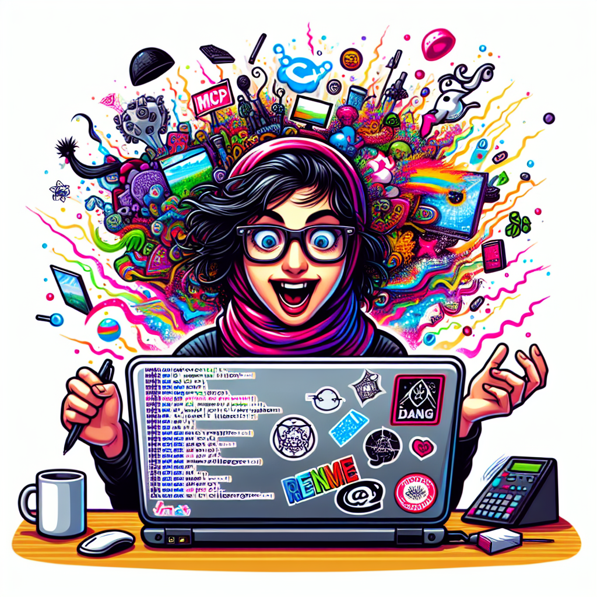

# AI Image Generation MCP Server

<p align="center">
  
</p>

[](https://www.python.org/downloads/)
[](https://opensource.org/licenses/MIT)
[](https://github.com/psf/black)
[](https://modelcontextprotocol.io/)

An MCP (Model Context Protocol) server that provides AI image generation capabilities through multiple models including DALL-E 3, DALL-E 2, and GPT-Image-1.

## Features

- 🎨 **Multiple AI Models**: Support for DALL-E 3, DALL-E 2, and GPT-Image-1
- 🚀 **MCP Integration**: Works seamlessly with Claude Desktop and other MCP clients
- 💾 **Local Storage**: Automatic image storage with metadata tracking
- 🔧 **Flexible Configuration**: Environment-based configuration
- ✨ **Rich Prompts**: Built-in prompt templates for common use cases

## Quick Start

### Prerequisites

- Python 3.11 or higher
- OpenAI API key
- Claude Desktop (for MCP integration)

### Installation

1. Clone the repository:
```bash
git clone https://github.com/krystian-ai/ai-image-gen-mcp.git
cd ai-image-gen-mcp
```

2. Create and activate virtual environment:
```bash
python3.11 -m venv .venv
source .venv/bin/activate  # On Windows: .venv\Scripts\activate
```

3. Install dependencies:
```bash
pip install -e ".[image,dev]"
```

4. Configure environment:
```bash
cp .env.example .env
# Edit .env and add your OpenAI API key
```

### Claude Desktop Integration

Add to your Claude Desktop config (`~/Library/Application Support/Claude/claude_desktop_config.json` on macOS):

```json
{
  "mcpServers": {
    "ai-image-gen": {
      "command": "/path/to/ai-image-gen-mcp/.venv/bin/python",
      "args": ["-m", "ai_image_gen_mcp.server", "stdio"],
      "transport": "STDIO",
      "env": {
        "PYTHONPATH": "/path/to/ai-image-gen-mcp/src",
        "OPENAI_API_KEY": "your-api-key-here"
      }
    }
  }
}
```

### Claude Code Integration

For [Claude Code](https://github.com/anthropics/claude-code) AI coding assistant, you have two options:

#### Option 1: Using .mcp.json (Recommended)

1. Create a `.mcp.json` file in your project root:

```json
{
  "ai-image-gen": {
    "command": "python",
    "args": ["-m", "ai_image_gen_mcp.server", "stdio"],
    "transport": "STDIO",
    "env": {
      "PYTHONPATH": "src",
      "OPENAI_API_KEY": "your-api-key-here"
    }
  }
}
```

2. Claude Code will automatically detect and use this MCP server when you open the project.

#### Option 2: Global Configuration

Add to your global Claude Code settings (`~/.config/claude-code/settings.json`):

```json
{
  "mcpServers": {
    "ai-image-gen": {
      "command": "/path/to/ai-image-gen-mcp/.venv/bin/python",
      "args": ["-m", "ai_image_gen_mcp.server", "stdio"],
      "transport": "STDIO",
      "env": {
        "PYTHONPATH": "/path/to/ai-image-gen-mcp/src",
        "OPENAI_API_KEY": "your-api-key-here"
      }
    }
  }
}
```

**Note**: If using a virtual environment, ensure you use the full path to the Python executable within the `.venv` directory.

## Usage

### In Claude Desktop

After configuration, you can use the image generation tools:

```
Generate an image of a serene mountain landscape at sunset
```

Claude will use the `generate_image` tool to create your image.

### Available Models

- **DALL-E 3** (default): Best quality, supports custom sizes and styles
- **DALL-E 2**: Previous generation, supports batch generation
- **GPT-Image-1**: Experimental multimodal model

### Prompt Templates

The server includes built-in prompt templates:

- `product_mockup`: Professional product photography prompts
- `concept_art`: Artistic concept generation prompts

## Troubleshooting

### Claude Code Integration Issues

1. **MCP server not detected**: Ensure `.mcp.json` is in the project root directory
2. **API key errors**: Verify your OpenAI API key is correctly set in the environment
3. **Python path issues**: Use absolute paths to your virtual environment's Python executable
4. **Module not found**: Ensure `PYTHONPATH` includes the `src` directory

## Development

### Running Tests

```bash
pytest                    # Run all tests
pytest --cov             # With coverage
python test_dalle.py     # Test actual image generation
```

### Code Quality

```bash
black src/               # Format code
ruff check src/         # Lint
mypy src/               # Type check
```

## Configuration

Key environment variables:

- `OPENAI_API_KEY`: Your OpenAI API key (required)
- `MODEL_DEFAULT`: Default model ID (default: gpt-4.1-mini)
- `MODEL_PROVIDER`: Provider name (default: openai)
- `CACHE_DIR`: Image storage directory (default: /tmp/ai-image-gen-cache)
- `LOG_LEVEL`: Logging level (default: INFO)

## Architecture

The server follows a modular architecture:

1. **MCP Server**: FastMCP-based server handling JSON-RPC protocol
2. **Model Router**: Strategy pattern for model selection
3. **Storage Layer**: Local filesystem with metadata tracking
4. **Model Implementations**: Separate classes for each AI model

## Contributing

See [CONTRIBUTING.md](CONTRIBUTING.md) for development guidelines.

## License

MIT License - see [LICENSE](LICENSE) for details.

## Acknowledgments

- Built with [FastMCP](https://github.com/jlowin/fastmcp)
- Uses OpenAI's DALL-E and GPT-Image models
- Implements the [Model Context Protocol](https://modelcontextprotocol.io/)