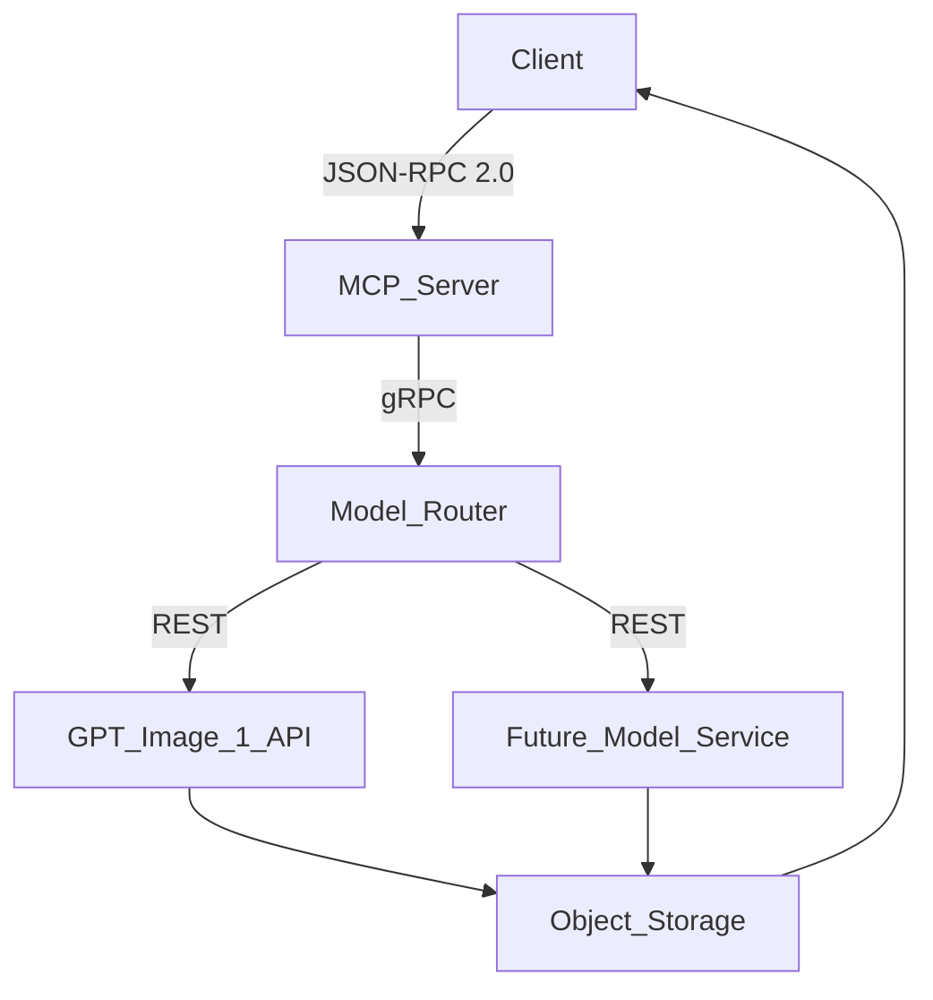

## Product Requirements Document (PRD)

### MCP Image Generation Server

**Version:** 0.9 – 2025‑07‑16\
**Author:** AI‑Infra Team\
**Target MVP Date:** 30 September 2025

---

### 1. Executive Summary

The MCP Image Generation Server will expose a new `generate_image` tool compliant with the **Model Context Protocol (MCP)** specification (2025‑06‑18). This service will let any MCP‑capable client (e.g. Claude for Desktop, VS Code extensions, or first‑party apps) create images through state‑of‑the‑art generative models.

Our MVP ships with **GPT‑Image‑1 (OpenAI)** as the first supported mode. The architecture is model‑agnostic, enabling us to plug in additional hosted or on‑prem models – including open‑source diffusion models – with minimal effort.

**Primary Goals**

1. Provide a standards‑based, secure, and scalable image‑generation endpoint for internal and external product teams.
2. Abstract away model specifics so clients interact only with MCP resources and tools.
3. Reduce time‑to‑market for future multimodal features (e.g. image + text workflows).

### 2. Problem Statement

Teams across the company are building multimodal user experiences but currently integrate directly with model‑specific SDKs or REST APIs. This causes:

- Fragmented authentication & rate‑limiting logic.
- Duplicate orchestration code.
- Slow rollout of new models.

A unified MCP Server solves these gaps by providing a common protocol surface.

### 3. Scope

| In‑Scope (MVP)                           | Out‑of‑Scope (Future)               |
| ---------------------------------------- | ----------------------------------- |
| \* `generate_image` tool (JSON‑RPC 2.0)  | Editing / in‑painting tools         |
| Hosted GPT‑Image‑1 backend               | Video generation                    |
| User config options: prompt, style, size | Fine‑tuning UI                      |
| Usage metering & rate limits             | Advanced A/B routing between models |

### 4. User Stories

- **Dev‑001** – *As an application developer* I call `generate_image` with a prompt and receive a URL to the generated PNG so that I can embed the image in my product UI.
- **UX‑002** – *As a designer* I can choose a style preset (e.g. "photorealistic", "anime") to rapidly prototype visuals.
- **Admin‑003** – *As a platform admin* I can set per‑org quotas and monitor usage in Grafana.

### 5. Functional Requirements

| #   | Requirement                                                                                    |
| --- | ---------------------------------------------------------------------------------------------- |
| F‑1 | Expose an MCP **Resource** named `image_gen` with a **Tool** `generate_image`.                 |
| F‑2 | Accept payload fields: `prompt` (string), `style` (enum), `size` (enum), `n` (int, default 1). |
| F‑3 | Return `image_urls` array with signed links valid for ≥24 h.                                   |
| F‑4 | Support capability negotiation per MCP §4.3.                                                   |
| F‑5 | Enforce auth via existing IAM tokens and propagate user ID for audit.                          |
| F‑6 | Log structured events (JSON) for analytics and billing.                                        |

### 6. Non‑Functional Requirements

- **Performance:** <1 s p95 server processing latency before model inference; end‑to‑end <10 s for standard 1024×1024 output.
- **Scalability:** Horizontal autoscaling via Kubernetes HPA; load tested to 500 RPS burst.
- **Reliability:** 99.9 % monthly uptime; graceful degradation to fallback model.
- **Security:** TLS 1.3, OWASP Top‑10 hardening, signed URLs, request/response size limits.
- **Compliance:** SOC 2 type II logging; GDPR data retention <30 days.

### 7. Architecture

- **MCP Server** – Validates requests, applies auth, exposes MCP discovery & resources.
- **Model Router** – Switches between GPT‑Image‑1 and future backends via strategy pattern.
- **Object Storage** – Stores generated images (AWS S3 / GCS) and returns signed URLs.

### 8. MVP Definition

Minimum set to launch Beta:

1. `generate_image` implemented with GPT‑Image‑1.
2. Basic style presets (`default`, `photorealistic`, `illustration`).
3. Observability dashboards (latency, error rate, utilization).
4. Rate‑limiting by API key (config file driven).
5. Internal documentation & sample code snippet.

### 9. Roadmap

| Quarter     | Milestone                                                             |
| ----------- | --------------------------------------------------------------------- |
| **Q3 2025** | MVP GA – hosted GPT‑Image‑1                                           |
| **Q4 2025** | Add open‑source Stable Diffusion 3 (GPU‑auto‑scaled)                  |
| **Q1 2026** | Image editing & in‑painting tools; dynamic model selection per prompt |
| **Q2 2026** | On‑prem deployment option for regulated customers                     |

### 10. Success Metrics (KPIs)

- **Adoption:** ≥3 internal teams integrated within 1 month of GA.
- **Latency:** p95 <10 s for 1024×1024.
- **Reliability:** <0.1 % error rate (5xx) per day.
- **Cost per image:** ≤\$0.002 across weighted traffic.

### 11. Risks & Mitigations

| Risk                       | Likelihood | Impact | Mitigation                                              |
| -------------------------- | ---------- | ------ | ------------------------------------------------------- |
| Model API quota exhaustion | Medium     | High   | Monitor usage; reserve capacity; auto‑scale GPUs        |
| Large image payload DoS    | Low        | High   | Enforce request size limit 2 KiB; output size cap 4 MiB |
| Compliance audit delays    | Medium     | Medium | Engage Security early; automated evidence collection    |

### 12. Assumptions

- IAM tokens already include org/user context suitable for per‑tenant limits.
- Object storage costs are covered by Platform budget.
- GPT‑Image‑1 SLA meets performance targets.

### 13. Appendices & References

- [MCP Introduction](https://modelcontextprotocol.io/introduction)
- [MCP Server Quickstart](https://modelcontextprotocol.io/quickstart/server)
- [MCP Specification (2025‑06‑18)](https://modelcontextprotocol.io/specification/2025-06-18)
- RFC 8259 – JSON specification
- JSON‑RPC 2.0 specification

---

© 2025 AI‑Infra Team – Confidential

